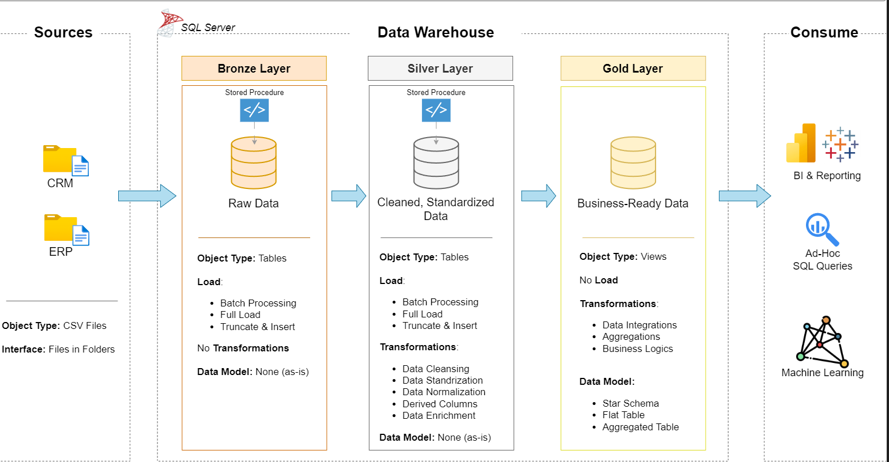

# Data Warehouse and Analytics Project  
# Projet de Data Warehouse et d’Analyse  

Welcome to the **Data Warehouse and Analytics Project** repository! 🚀  
Bienvenue dans le dépôt du **Projet de Data Warehouse et d’Analyse** ! 🚀  

This project demonstrates a comprehensive data warehousing and analytics solution, from building a data warehouse to generating actionable insights. Designed as a portfolio project, it highlights industry best practices in data engineering and analytics.  
Ce projet présente une solution complète de data warehousing et d’analytique, allant de la construction d’un entrepôt de données jusqu’à la génération d’insights exploitables. Conçu comme un projet de portfolio, il met en avant les meilleures pratiques de l’industrie en ingénierie des données et en analyse.  

---

## 🏗️ Data Architecture  
## 🏗️ Architecture des Données  

The data architecture for this project follows Medallion Architecture **Bronze**, **Silver**, and **Gold** layers:  
L’architecture des données de ce projet suit l’architecture Médaillon avec les couches **Bronze**, **Silver** et **Gold** :  

  

1. **Bronze Layer**: Stores raw data as-is from the source systems. Data is ingested from CSV Files into SQL Server Database.  
   **Couche Bronze** : Stocke les données brutes telles qu’elles proviennent des systèmes sources. Les données sont importées à partir de fichiers CSV dans une base SQL Server.  

2. **Silver Layer**: This layer includes data cleansing, standardization, and normalization processes to prepare data for analysis.  
   **Couche Silver** : Cette couche inclut les processus de nettoyage, de standardisation et de normalisation des données pour les préparer à l’analyse.  

3. **Gold Layer**: Houses business-ready data modeled into a star schema required for reporting and analytics.  
   **Couche Gold** : Contient des données prêtes pour le métier, modélisées en schéma en étoile, nécessaires pour le reporting et l’analytique.  

---

## 📖 Project Overview  
## 📖 Aperçu du Projet  

This project involves:  
Ce projet comprend :  

1. **Data Architecture**: Designing a Modern Data Warehouse Using Medallion Architecture **Bronze**, **Silver**, and **Gold** layers.  
   **Architecture des données** : Conception d’un entrepôt de données moderne basé sur l’architecture Médaillon avec les couches **Bronze**, **Silver** et **Gold**.  

2. **ETL Pipelines**: Extracting, transforming, and loading data from source systems into the warehouse.  
   **Pipelines ETL** : Extraction, transformation et chargement des données des systèmes sources vers l’entrepôt.  

3. **Data Modeling**: Developing fact and dimension tables optimized for analytical queries.  
   **Modélisation des données** : Développement de tables de faits et de dimensions optimisées pour les requêtes analytiques.  

4. **Analytics & Reporting**: Creating SQL-based reports and dashboards for actionable insights.  
   **Analytique & Reporting** : Création de rapports SQL et de tableaux de bord pour fournir des insights exploitables.  

---

## 🛠️ Important Tools  
## 🛠️ Outils Importants  

SQL Server Express: Lightweight server for hosting your SQL database.  
**SQL Server Express** : Serveur léger pour héberger votre base de données SQL.  

SQL Server Management Studio (SSMS): GUI for managing and interacting with databases.  
**SQL Server Management Studio (SSMS)** : Interface graphique pour gérer et interagir avec les bases de données.  

---

## 🗓️ Project Requirements  
## 🗓️ Exigences du Projet  

### Building the Data Warehouse (Data Engineering)  
### Construction du Data Warehouse (Ingénierie des Données)  

#### Objective  
#### Objectif  

Develop a modern data warehouse using MySQL Workbench to consolidate sales data, enabling analytical reporting and informed decision-making.  
Développer un entrepôt de données moderne avec MySQL Workbench afin de consolider les données de ventes, permettant un reporting analytique et une prise de décision éclairée.  

#### Specifications  
#### Spécifications  

- **Data Sources** : Import data from two source systems (ERP and CRM) provided as CSV files.  
  **Sources de données** : Importer les données de deux systèmes sources (ERP et CRM) fournis sous forme de fichiers CSV.  

- **Data Quality** : Cleanse and resolve data quality issues prior to analysis.  
  **Qualité des données** : Nettoyer et résoudre les problèmes de qualité des données avant l’analyse.  

- **Integration** : Combine both sources into a single, user-friendly data model designed for analytical queries.  
  **Intégration** : Combiner les deux sources dans un modèle de données unique et convivial conçu pour les requêtes analytiques.  

- **Scope** : Focus on the latest dataset only; historization of data is not required.  
  **Portée** : Se concentrer uniquement sur le jeu de données le plus récent ; l’historisation des données n’est pas requise.  

- **Documentation** : Provide clear documentation of the data model to support both business stakeholders and analytics teams.  
  **Documentation** : Fournir une documentation claire du modèle de données pour soutenir à la fois les parties prenantes métiers et les équipes analytiques.  

---

### 📊 BI: Analytics & Reporting (Data Analysis)  
### 📊 BI : Analytique & Reporting (Analyse de Données)  

#### Objective  
#### Objectif  

Develop SQL-based analytics to deliver detailed insights into:  
Développer des analyses basées sur SQL pour fournir des insights détaillés sur :  

- **Customer Behavior**  
  **Comportement des clients**  

- **Product Performance**  
  **Performance des produits**  

- **Sales Trends**  
  **Tendances des ventes**  

These insights empower stakeholders with key business metrics, enabling strategic decision-making.  
Ces insights fournissent aux parties prenantes des indicateurs clés, facilitant la prise de décisions stratégiques.  

---

## 🛡️ License  
## 🛡️ Licence  

This project is licensed under the MIT License. You are free to use, modify, and share this project with proper attribution.  
Ce projet est sous licence MIT. Vous êtes libre de l’utiliser, le modifier et le partager avec attribution appropriée.  

---

## 🌟 About Me  
## 🌟 À propos de moi  

Hi there! I'm **Hocine DRIOUECHE**  
Bonjour ! Je suis **Hocine DRIOUECHE**  
